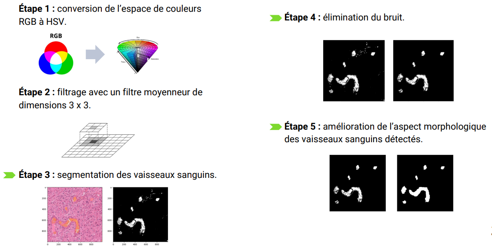

# Image-project
The goal of this project is to develop an automatic method for detecting blood vessels in histological images of brain tumors stained using the Hematoxylin and Eosin (H&E) method. The developed method follows these steps:

- Color space conversion: Conversion from RGB to HSV color space.
- Blood vessel segmentation: A segmentation step is implemented to obtain a binary mask representing the initial detection of blood vessels. Two approaches, K-means clustering and fixed thresholding based on channel and histogram analysis, yielded good results.
- Noise elimination: Three approaches were tested:
    - A simple median filter.
    - Detection of connected components (using 8-connectivity) and removal of components below a certain size threshold.
    - Application of erosion, a mathematical morphology operation.
- Enhancement of the morphological appearance of blood vessels: The goal is to improve the visual appearance of the blood vessels in terms of shape, size, continuity, and regularity. Two approaches were used: closing operation and interpolation of components using cubic splines.

**Results:** The method shows promising results but has some limitations. Specifically, it is limited to detecting blood vessels with clear visual characteristics of blood presence, and in some cases, it fails to detect the entire vessel. Furthermore, the various steps must be adjusted based on the size and shape of the vessels, particularly regarding thresholds and the shape and size of the structuring element used in morphological operations.

**Future work:** In future work, it would be valuable to combine the steps of this classical approach with deep learning models to automate the detection and identify vessels that are less visually explicit. However, this would require the availability of large, labeled datasets. Additionally, integrating the images with knowledge and insights provided by medical professionals would be beneficial in a deep learning approach.

The project was under the supervision of Professor Isabelle Bloch.

